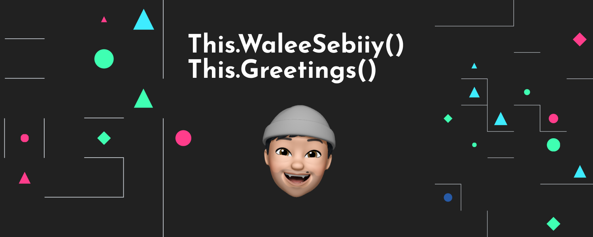

  

### Welcome to my GitHub page 👋

Crafting interfaces. Building performant software and web experience, trying to achieve minimalism,  sharing what i know about design and code, currently a Software Engineering Student.

#### My Skills

 

 

 

